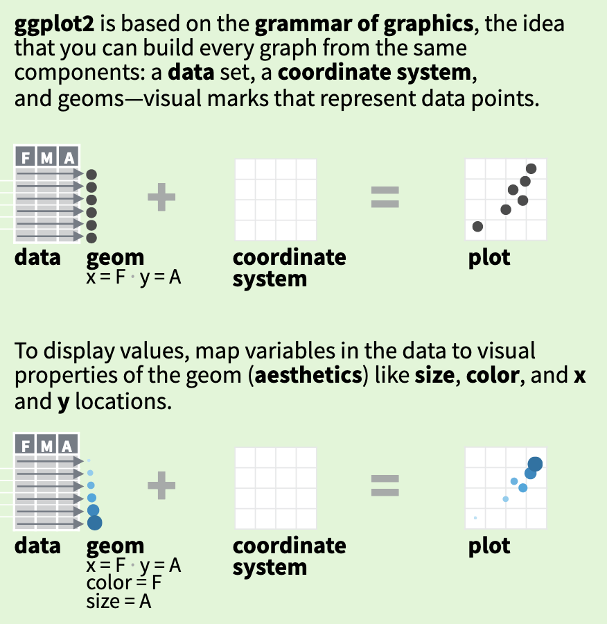

```{r setup, include=FALSE, echo=F}
knitr::opts_chunk$set(echo = TRUE, fig.width=16, fig.height=9, dpi=150, highlight=T)

require(tidyverse)
require(knitr)
require(gridExtra)
```

# Introduction

## Preliminaries

* Certificates of attendance
  + You need to attend all 6 sessions.
  + Sign in & check spelling of name on the sign-in sheet!
  + Only issued if paid-up and in exchange for completed feedback form.

$$\,$$ 

* Course website / GitHub: [https://github.com/mlw-stats/R_And_Statistics_Training_2026](https://github.com/mlw-stats/R_And_Statistics_Training_2026)

$$\,$$

* Office hours
  + **Vester** - Mondays @ 2pm; **Kapeni Meeting 1**
  + **Eva** - Tuesdays @ 2pm; **Creator Ground Floor**
  + **Marc** - Thursdays @ 9am; **Kapeni Meeting 2**
  + **Jessie** - Mondays @ 3pm; **Kapeni Hurdle 1**
  
$$\,$$ 
  
* Housekeeping
  + Refreshments (no lunch - sorry)
  + Fire exits & bathrooms


## Learning outcomes

1. **KNOW R**: Explain know what R is & what it can do. 
2. **KNOW R RESOURCES**: List useful R resources and access them. 
3. **DO R**: Perform basic operations relevant for your research in R:
    a. Read data into R & write data or results to the harddrive.
    b. Manipulate & use different object types.
    c. Write & use functions in R
    d. Perform basic analyses on a dataset: mean, standard deviation, linear regression.
    e. Produce various standard graphs and tables
4. **UNDERSTAND BASICS OF STATISTICS**: Explain basic statistical theory: common distributions, standard statistical techniques, common study designs, assumptions behind common statistical tests and regression models.
5. **UNDERSTAND STUDY DESIGNS**: Recommend appropriate designs & analyses.
6. **COMPREHEND OPEN SCIENCE**: Summarise principles of open, reproducible research.
7. **DO OPEN SCIENCE WITH R**: Use R scripts, R markdown, packages & GitHub.

## Preliminaries


# A little exercise

## A little exercise

$$\,$$

$$\,$$

What is a graph? Can you give examples?

$$\,$$

What are elements of a graph?

$$\,$$
What is the point of a graph?

# Grammar of graphics

## Basic figures & graphs

R has powerful data visualisation capabilities, especially when you start using packages.

The standard R visualisation library is `graphics`, which is installed when you install R and loaded automatically at start-up. The main function here is `plot()`.

However, the `graphics` package is quite basic and has inconsistent syntax and function names for different types of graphs.

The `tidyverse` comes with the R package `ggplot2` which provides a more consistent way of producing graphs (it is based on a **g**rammar of **g**raphics).

For example, let's do a scatter plot.


## Basic figures & graphs

```{r plot1a, eval=F}
iris %>%
  ggplot(mapping=aes(x=Petal.Length,y=Petal.Width,col=Species,pch=Species)) +
  geom_point() +
  scale_colour_manual(values=c("steelblue","orange","salmon"),name="Species") +
  scale_shape_manual(values=15:17,name="Species") +
  xlab("Petal length") +
  ylab("Petal width") +
  labs(title="Scatterplot of petal length and width in the iris dataset",caption="Figure produced during the KUHeS CRM R training, using ggplot2.") +
  theme_light()
```

```{r plot1b, echo=F}
iris %>%
  ggplot(mapping=aes(x=Petal.Length,y=Petal.Width,col=Species,pch=Species)) +
  geom_point(size=4) +
  scale_colour_manual(values=c("steelblue","orange","salmon"),name="Species") +
  scale_shape_manual(values=15:17,name="Species") +
  xlab("Petal length") +
  ylab("Petal width") +
  labs(title="Scatterplot of petal length and width in the iris dataset",caption="Figure produced during the KUHeS CRM R training, using ggplot2.") +
  theme_light() +
  theme(text=element_text(size=20))
```


## Basic figures & graphs

$$\,$$

The **aesthetic** (the `aes()` call in the above) defines *what* you will see, i.e. the data you will plot.

$$\,$$

The **geom** will define the geometry, i.e. *how* you will plot the data.

$$\,$$

The **coordinate system** governs the *data representation*.

$$\,$$

The **theme** defines the *visual style* (background, major & minor axes, font face & size, default colour scales, margins, text alignment, ...).


## Basic figures & graphs

{width=350px}


## Basic figures & graphs

$$\,$$

It would not make much sense, but we *could* decide to plot the same data from before not as a scatterplot but as a line graph.

$$\,$$

All we need to do is to change the geom from `geom_point()` to `geom_line()`.

## Basic figures & graphs

```{r plot2}
iris %>%
  ggplot(mapping=aes(x=Petal.Length,y=Petal.Width,col=Species,pch=Species)) +
  geom_line() +
  scale_colour_manual(values=c("steelblue","orange","salmon"),name="Species") +
  scale_shape_manual(values=15:17,name="Species") +
  xlab("Petal length") +
  ylab("Petal width") +
  labs(title="Line graph of petal length and width in the iris dataset",caption="Figure produced during the KUHeS CRM R training, using ggplot2.") +
  theme_light()
```


## Basic figures & graphs

$$\,$$

Even for very different graphs, there is very similar code to write with `ggplot2`.

$$\,$$

You can also use more than one geom on the same graph.


## Basic figures & graphs

```{r plot3}
iris %>%
  ggplot(mapping=aes(x=Species,y=Petal.Width,col=Species)) +
  geom_boxplot() +
  geom_jitter(height=0,width=0.2) +
  scale_colour_manual(values=c("steelblue","orange","salmon")) +
  scale_fill_manual(values=c("steelblue","orange","salmon")) +
  xlab("Species") +
  ylab("Petal width") +
  labs(title="Box and jitter plot of petal width against species in the iris dataset",caption="Figure produced during the MATSURV R training, using ggplot2.") 
```


# Resources

## Resources

$$\,$$

* The [R Graph Gallery](https://www.r-graph-gallery.com/) is an excellent resource to get started when you have a specific plot in mind that you want to do for your data.

$$\,$$

* The `ggplot2` [cheat sheet](https://rstudio.github.io/cheatsheets/html/data-visualization.html) is another excellent resource.


# Distribution figures


## Distribution figures

$$\,$$

Distributions: what values did you record for a given variable?

$$\,$$

* Discrete values (nominal, ordinal, integer-valued) values:
    + bar plots
    + pie charts
    
* Continuous values
    + histograms
    
Let's generate some data.


## Distribution figures

```{r}
typesTmp<- paste(sep="","type",1:3)
type<-factor(sample(typesTmp,
                    size=1000,
                    replace=T,
                    prob=c(0.45,0.3,0.25)))
x1<-rbinom(1000,size=1,prob=0.25)
x2<-rpois(1000,lambda=ifelse(type=="type3",6,4))
```


## Distribution figures

```{r}
dat<-data.frame(type,x1,x2) %>%
  mutate(x3=ifelse(type=="type1",
                   rnorm(sum(type=="type1"),mean=-2),
                   ifelse(type=="type2",
                          rnorm(sum(type=="type2"),mean=2),
                          runif(sum(type=="type3"))
                          )
                   )
         ) %>%
  mutate(x4=rnorm(n(),mean=x3))
```


## Distribution figures

$$\,$$

**Bar plots** simply show bars the height of which is proportional to the relative frequency of the different levels of a categorical variable in your dataset.

In `ggplot2`, the geom to use for barplots is `geom_barplot()`.

On the next few slides we generate simple bar plots for 3 variables.


## Distribution figures

```{r}
ggplot(data=dat,mapping=aes(x=x1)) +
  geom_bar()
```


## Distribution figures

```{r}
ggplot(data=dat,mapping=aes(x=x2)) +
  geom_bar()
```


## Distribution figures

```{r}
ggplot(data=dat,mapping=aes(x=type)) +
  geom_bar()
```


## Distribution figures

We can stratify a bar plot by a grouping variable (in this case the variable `type`).

```{r}
dat %>%
  count(type,x2) %>%
  complete(type,x2,fill=list(n=0)) %>%
  ggplot(mapping=aes(fill=type,y=n,x=x2)) +
  geom_bar(position="dodge",stat="identity") +
  theme(text = element_text(size=20))
```


## Distribution figures

You can customise graphs by adding other options for the coordinate system, the annotations, the theme etc.

```{r}
ggplot(data=dat,mapping=aes(x=x2)) + 
  geom_bar() +
  coord_flip() +
  ggtitle("Barplot for variable x2") +
  xlab("values") +
  ylab("count") +
  theme(text = element_text(size=20))
```


## Distribution figures

You can change the coordinate system to get a circular plot (note, use these carefully - most often they are NOT a good idea).

For this you can use `coord_polar()`.

To get annotations for each bar, requires a bit more work (but see the [R Graph Gallery](https://www.r-graph-gallery.com/circular-barplot.html) for examples).


```{r}
ggplot(data=dat,mapping=aes(x=x2)) +
  geom_bar() + coord_polar(start=0) + theme_minimal() +
  theme(
    axis.text = element_blank(),
    axis.title = element_blank(),
    panel.grid = element_blank(),
    plot.margin = unit(rep(-2,4), "cm") # removing unnecessary margins
  ) +
  ylim(-100,250) # dtermines size of the inner radius
```

## Distribution figures

$$\,$$

In `ggplot2`, **pie charts** are just bar charts with a special (polar) coordinate system.

```{r}
ggplot(dat, mapping=aes(x=factor(1), fill=factor(type))) +
  geom_bar(width = 1) +
  coord_polar("y") + 
  xlab("") +
  theme_void()
```


## Distribution figures

$$\,$$

Note:

$$\,$$

Generally, R discourages the use of pie charts (they are horrible & misleading - human brains are not good at judging the relative sizes of areas).


## Distribution figures

**Histograms** are useful graphs. They:

* Summarise the distribution of continuous variables, by binning data into discrete intervals.
* Can be used for binary and discrete variables as well, but barplots better suited for such variables.

In `ggplot2`, the `geom_histogram()` is used to generate histograms.

```{r}
ggplot(data=dat,mapping=aes(x=x3)) +
  geom_histogram()
```


## Distribution figures

$$\,$$

Note the warning message above. You can ignore this, but R is just trying to tell you that other bin widths  / number of bins may work better. You can set this by specifying the `bins` or the `bindwidth` parameter.

$$\,$$

```{r}
ggplot(data=dat,mapping=aes(x=x3)) +
  geom_histogram(binwidth=0.1)

ggplot(data=dat,mapping=aes(x=x3,stat(density))) +
  geom_histogram(binwidth=0.15)
```


## Distribution figures

$$\,$$

There's many other parameters you can specify to customise the histogram graph.

```{r}
ggplot(data=dat,mapping=aes(x=x3,stat(density))) +
  geom_histogram(binwidth=0.15) +
  coord_cartesian(xlim = c(-10, 10)) +
  ggtitle("Histogram") +
  theme_light() +
  theme(text=element_text(size=24))
```


## Distribution figures

$$\,$$

We can add kernel density estimates for the distribution function.

```{r}
ggplot(data=dat,mapping=aes(x=x3,stat(density))) +
  geom_histogram(binwidth=0.15) +
  geom_density(bw="SJ",col="blue",lwd=1)
```


## Distribution figures

$$\,$$

We can stratify by a grouping variable (variable `type` in this case).

```{r}
ggplot(data=dat,mapping=aes(x=x3,fill=type)) +
  geom_histogram(binwidth=0.15,position="dodge")
```


## Distribution figures

You can change the default colours that are being used for the `type` variable.

The aesthetic element governing the colour of the bars is the variable specified by `fill=type`.

So to change the colours, we need to use the function `scale_fill_manual()`. 

```{r}
ggplot(data=dat,mapping=aes(x=x3,fill=type)) +
  geom_histogram(binwidth=0.15,position="dodge") +
  scale_fill_manual(values=c("steelblue","orange","salmon"))
```


# Covariation figures

## Covariation figures

$$\,$$

Covariation figures let you visually explore whether there is a relationship between 2 or more variables.


## Covariation figures

$$\,$$

**Boxplots**, and their variation violin plots, allow you to explore what, if any, relationship there is between a binary / discrete / categorical and a continuous variable.

For boxplots the geom `geom_boxplot()` is used is used.

$$\,$$

```{r}
ggplot(data=dat,mapping=aes(x=type,y=x3)) +
  geom_boxplot()
```


## Covariation figures

$$\,$$

Often it is nice to add individual data points on top. To better display these (since they all have the same x-axis coordinate), you need to add jitter to their x-axis coordinates. `ggplot2` provides a geom for this: `geom_jitter()`. By specifying some transparency (the `alpha` parameter), it is easier to get an idea where the data density is highest.

$$\,$$

```{r}
ggplot(data=dat,mapping=aes(x=type,y=x3)) +
  geom_boxplot() +
  geom_jitter(width=0.25,height=0,alpha=0.3)
```


## Covariation figures

$$\,$$

You can also generate horizontal boxplots, by flipping the coordinate system.

$$\,$$

```{r}
ggplot(data=dat,mapping=aes(x=type,y=x3)) +
  geom_boxplot() +
  coord_flip()
```


## Covariation figures

$$\,$$

It is important that you understand what information is summarised in a boxplot.


## Covariation figures


## Covariation figures

$$\,$$

**Violin plots** are similar to boxplots, but they combine box plots with histograms.

In `ggplot2`, the geom `geom_violin()` is used to generate these types of graphs.

$$\,$$

```{r}
ggplot(data=dat,mapping=aes(x=type,y=x3,fill=type)) +
  geom_violin() +
  geom_boxplot(width=0.05, fill="white")
```


## Covariation figures

The **scatter plot**, which shows 2 continuous variables plotted against each other, is probably the most basic and most used covariation plot.

For example, it is the basis of any graph showing a regression model.

The geom `geom_point()` is used to generate scatter plots in `ggplot2`.

$$\,$$

```{r}
ggplot(data=dat,mapping=aes(x=x3,y=x4)) +
  geom_point()
```


## Covariation figures

$$\,$$

This can be customised and you can easily add smooth regression lines with `geom_smooth()`.

Note that the colour of the individual points is given by the `col` argument and so `scale_colour_manual()` is used to specify colours (rather than `scale_fill_manual()` as was used above in the example for histograms).

$$\,$$


## Covariation figures

```{r}
ggplot(data=dat,mapping=aes(x=x3,y=x4,col=type)) +
  geom_point() +
  geom_smooth() +
  scale_colour_manual(values=c("steelblue","salmon","orange"),
                      name="Type") +
  xlab("Variable x3") +
  ylab("Variable x4") +
  ggtitle("A covariation plot.") +
  theme_light() +
  theme(text=element_text(size=14))
```


## Covariation figures

$$\,$$

If one of the 2 variables has an order to it, such as e.g. a time variable, then **line graphs** may be better suited.

The geom `geom_line()` is used for this.

For an example, we will use a dataset that comes with R: `beavers` which consists of body temperature measurements from 2 beavers, stored in data frame `beaver1` and `beaver2`.


## Covariation figures

$$\,$$

```{r}
beaver<-rbind(beaver1[beaver1$day==346,],beaver2[beaver2$day==307,])
beaver<-data.frame(
  name=c(rep("beaver1",sum(beaver1$day==346)),
         rep("beaver2",sum(beaver2$day==307))),beaver)
```


## Covariation figures

$$\,$$

For a simple line graph, you just need and x and a y variable.

$$\,$$

```{r}
beaver %>%
  filter(name=="beaver1") %>%
  ggplot(mapping=aes(x=time,y=temp)) +
    geom_line()
```


## Covariation figures

$$\,$$

You can easily stratify a line graph by a grouping variable (in this case the variable `name`) in `ggplot2`.

$$\,$$

```{r}
ggplot(data=beaver,mapping=aes(x=time,y=temp,colour=name)) +
  geom_line(lwd=1.5) # the lwd parameter sets the line width
```


## Covariation figures

$$\,$$

**Heatmaps** are useful to show covariation among 3 variables.

The x- and y-axis show 2 of the variables and the third variable determines the colour of cells.

The variables can be either categorical or continuous.

In `ggplot2`, one geom that you can use for heatmaps is `geom_tile()`.

First, we need some data.


## Covariation figures

```{r}
dens<-function(x,y){
  return(
    0.35*dnorm(x)*dnorm(y,sd=1.5) + 
    0.65*dnorm(x,mean=2,sd=2)*dnorm(y,mean=3)
  )
}

x<-seq(-2.5,6.5,by=0.05)
y<-seq(-3,5.5,by=0.05)

densSurf<-expand.grid(x=x,y=y) %>%
  mutate(dens=dens(x,y))
```


## Covariation figures

$$\,$$

Then we can do a basic heat map, using default colours.

$$\,$$

```{r}
densSurf %>%
  ggplot(mapping=aes(x=x,y=y,fill=dens)) +
  geom_tile(width=0.05,height=0.05)
```


## Covariation figures

But we can also provide custom colour scales.

```{r}
clrs<-colorRampPalette(c("blue","red","orange","yellow","white"))

densSurf %>%
  ggplot(mapping=aes(x=x,y=y,fill=dens)) +
  geom_tile(width=0.05,height=0.05) +
  scale_fill_gradientn(colours = clrs(200),name="probability density") +
  theme_minimal()
```


## Covariation figures

$$\,$$

**Contour plots** are similar but use contour lines rather than colour scales to show variation in the third variable.


$$\,$$

```{r}
ggplot(data=densSurf,mapping=aes(x=x,y=y,z=dens)) +
  geom_contour()
```


## Covariation figures

You can combine heampaps and contour plots.

```{r}
densSurf %>%
  ggplot(mapping=aes(x=x,y=y,fill=dens,z=dens)) +
  geom_tile(width=0.05,height=0.05) +
  geom_contour(col="darkgrey",lwd=0.35,alpha=0.75) +
  scale_fill_gradientn(colours = clrs(200),name="probability density") +
  theme_minimal()
```


# Multi-panel figures

## Multi-panel figures

There's multiple ways to generate multi-panel figures. Here we just cover 2 examples.

For a basic, but general way of combining multipe graphs onto the same figure, the function `grid.arrange()` from the R package `gridExtra` can be used.

The procedure is very simple:

  * Load the package (if not loaded already): `library(gridExtra)`
  * Assign each `ggplot()` call to an object (e.g. `p1<-ggplot(...) + ...`)
  * Produce a multipanel figure with `grid.arrange(p1,p2,...,nrow=2)`

The `nrow` parameter specifies over how many rows you want to arrange the plots.


## Multi-panel figures

```{r, fig.width=16, fig.height=8, message=F, warning=F}
g1<-ggplot(data=dat,mapping=aes(x=type,y=x3)) +
  geom_boxplot() +
  geom_jitter(width=0.25,height=0,alpha=0.3) +
  xlab("") +
  ylab("Variable x3") +
  ggtitle("A box & jitter plot.") +
  theme_minimal()
```


## Multi-panel figures

```{r}
g2<-ggplot(data=dat,mapping=aes(x=x3,y=x4,col=type)) +
  geom_point() +
  geom_smooth() +
  scale_colour_manual(values=c("steelblue","salmon","orange"),
                      name="Type") +
  xlab("Variable x3") +
  ylab("Variable x4") +
  ggtitle("A covariation plot.") +
  theme_light() +
  theme(text=element_text(size=14))
```


## Multi-panel figures

```{r}
grid.arrange(g1,g2,nrow=1)
```


## Multi-panel figures

The other approach we will cover, is if you want to repeat the same graph for different groups of observations within your dataset.

This is called **faceting** and in `ggplot2` the function `facet_wrap()` allows to do this very easily.

```{r}
iris %>%
  ggplot(mapping=aes(x=Petal.Length,y=Petal.Width)) +
  geom_point() +
  facet_wrap(~Species)
```


# Saving graphs to files


## Saving figures

$$\,$$

In `ggplot2`, the simplest way to save graphs is to use the function `ggsave()`.

$$\,$$

```{r, eval=F}
ggsave(g1,filename="myplot.png",width=16,height=9,units="cm",dpi=450)
```


## Saving figures

$$\,$$

Another way is to enclose your plotting code inside a statement that specifies a *graphics device*. "Graphics device" means a pdf, png, jpg or other file.

$$\,$$

Example:

```{r, eval=F}
pdf(width=16,height=9,file="myfile.pdf") # opens the device; pdf will produce vector graphics
# plotting code here
dev.off() # closes the device
```


## Saving figures

$$\,$$

Or:

```{r, eval=F}
png(width=16,height=9,units="in",res=450) # raster graphics
# plotting code here
dev.off()
```


##

$$\,$$

[end of Session 2]
